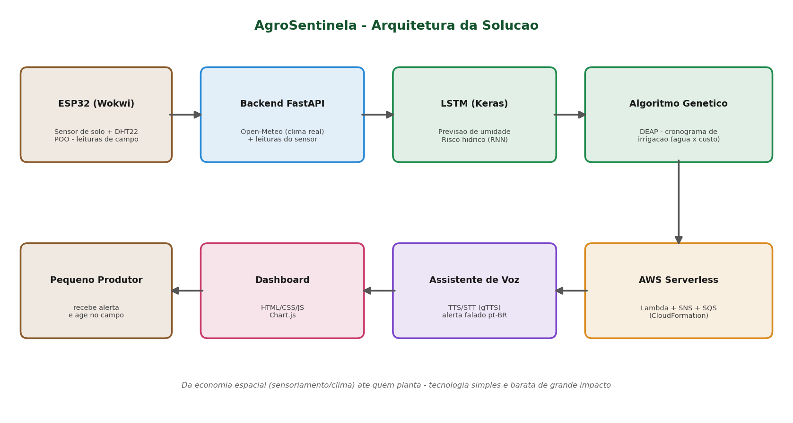

# FIAP - Faculdade de Informática e Administração Paulista

<p align="center">
<a href="https://www.fiap.com.br/"></a>
</p>

<br>

# 🌱 AgroSentinela

## Global Solution 2026.1 — Grupo 14

> **IA como Fertilizante Digital — um novo agronegócio do amanhã**
> Levando os dados do espaço até quem planta. 🛰️➡️🌾

### 🏆 QUERO CONCORRER

---

## 👨‍🎓 Integrantes:
- <a href="https://www.linkedin.com/">Vitorio Stevanatto Compri Paciulo</a> — RM56789

> Entrega individual autorizada pela professora.

## 👩‍🏫 Professores:
### Tutor(a)
- _(preencher)_
### Coordenador(a)
- _(preencher)_

---

## 📜 Descrição

**E se o pequeno produtor rural tivesse um agrônomo de plantão, 24 horas por dia, de graça?** O **AgroSentinela** é exatamente isso: uma plataforma de **baixíssimo custo** que une um sensor **ESP32**, **dados climáticos reais de satélite** e **duas Inteligências Artificiais** para dizer ao produtor, em linguagem simples e por voz, **se, quando e quanto irrigar** cada lavoura.

**O problema (real e caro).** O pequeno produtor irriga "no escuro": ou joga água demais — desperdiçando água, energia e dinheiro — ou descobre tarde que a terra secou e a colheita já sofreu. Falta a ele uma informação simples que o grande produtor já tem com agricultura de precisão.

**A nossa solução.** O AgroSentinela fecha esse ciclo de ponta a ponta:

1. 📡 **Sente o campo** — um nó ESP32 (simulado no Wokwi, zero hardware) mede a umidade do solo. O sistema completa com **clima real e em tempo real** da API Open-Meteo (gratuita, sem cadastro).
2. 🧠 **Prevê o futuro (IA 1 — Rede Neural LSTM)** — uma rede recorrente treinada com **17.496 horas reais** de clima de Ribeirão Preto/SP prevê como a umidade do solo vai evoluir nas próximas 24 horas (erro de apenas **0,010 m³/m³**).
3. 🧬 **Decide a melhor ação (IA 2 — Algoritmo Genético)** — testa milhares de planos de rega e escolhe o que mantém a planta saudável **gastando o mínimo de água**, respeitando a sede específica de cada uma das **10 culturas mais plantadas do Brasil**.
4. ☁️ **Alerta automático (AWS serverless)** — Lambda + SNS (simulados via CloudFormation) disparam o aviso de risco.
5. 🔊 **Fala com o produtor** — um assistente de voz comunica o alerta em português, acessível a quem tem pouca familiaridade com telas.
6. 📊 **Painel multi-campo** — vários ESP32 ao mesmo tempo, cada um numa cultura, num painel pensado para o agricultor (semáforo verde/vermelho, "regue X litros por m²").

**A ponte com a economia espacial.** Sensoriamento, dados climáticos e índices orbitais (NDVI, da Embrapa/INPE) só geram impacto na Terra quando chegam, traduzidos em ação, a quem produz alimento. É a metáfora que guia o projeto: o **"drone barato de grande impacto"** — tecnologia simples e acessível com efeito enorme no campo.

**Por que isso é forte:** dados **reais** (não inventados), **duas IAs** integradas e funcionando, **economia de água acima de 75%** frente à irrigação no escuro, interface **family-friendly**, arquitetura **serverless de custo quase zero** e **segurança por design** (LGPD, IAM de menor privilégio). Cobre **todas as disciplinas da fase** num sistema coeso e que **roda de verdade**.

---

## 🎬 Demonstração
- 🎥 **Vídeo (YouTube, não listado):** _(colar link)_
- 🖥️ **Painel:** rode `scripts/RODAR_AGROSENTINELA.bat` e abra `http://localhost:8000/app`



---

## 🧠 As duas Inteligências Artificiais

| IA | O que faz | Tecnologia | Resultado |
|----|-----------|------------|-----------|
| **1. Rede Neural LSTM** | Prevê a umidade do solo das próximas 24h | TensorFlow/Keras (RNN, 2 camadas) | MAE ≈ **0,010 m³/m³** em 17.496h reais |
| **2. Algoritmo Genético** | Otimiza o cronograma de irrigação (água × risco) | DEAP (seleção, cruzamento, mutação) | Economia **> 75%** de água |

A previsão **parte da leitura real do sensor**: se o ESP32 lê solo seco, a curva começa baixa e o plano manda mais água; se lê solo úmido, o plano zera. Cada cultura tem alvo próprio — o arroz pede ~40 mm/24h, a mandioca ~5 mm.

---

## 📁 Estrutura de pastas

- **assets**: imagens — logo, diagrama de arquitetura, gráficos das IAs, áudio do alerta.
- **config**: arquivos de configuração e dependências (`requirements.txt`).
- **data**: dados e saídas dos modelos (CSV real, modelo LSTM, `culturas.json`, previsões e cronogramas).
- **document**: PDF da entrega, seção de segurança (Red/Blue Team), guia do Wokwi e README técnico. Subpasta `other` para complementos.
- **scripts**: scripts de execução (`RODAR_`, `ABRIR_PAINEL`, `COMPILAR_ESP32`, `TUNEL`, `PUBLICAR_GITHUB`).
- **src**: todo o código-fonte — `backend` (coleta, LSTM, algoritmo genético, API), `frontend` (painel), `esp32` (Wokwi, POO), `voz` (TTS/STT) e `infra` (AWS serverless).
- **README.md**: este guia.

---

## 🔧 Como executar o código

**Pré-requisitos:** Windows com **Python 3.10+** (marque "Add to PATH"). Para a simulação do ESP32 no VS Code: extensão **Wokwi** + **arduino-cli** (o script instala).

**Rodar o painel (1 clique):**
1. Abra a pasta `scripts/` e dê duplo clique em **`RODAR_AGROSENTINELA.bat`**.
2. O painel abre em `http://localhost:8000/app`.
3. Para ver vários campos sem o Wokwi: rode `python src/esp32/enviar_leitura_teste.py --demo`.

**Simular os 4 sensores no Wokwi (ESP32):** veja o passo a passo em `document/wokwi_guia.md`.

**Re-treinar do zero (opcional):**
```bash
pip install -r config/requirements.txt
python src/backend/coleta_dados.py        # coleta o clima real
python src/backend/modelo_lstm.py         # treina a IA 1 (LSTM)
python src/backend/algoritmo_genetico.py  # roda a IA 2 (Algoritmo Genético)
```

---

## 📊 Resultados

| Indicador | Resultado |
|-----------|-----------|
| Dados climáticos reais coletados | **17.496 horas** (2 anos, Ribeirão Preto/SP) |
| Erro da previsão de umidade (LSTM) | MAE ≈ **0,010 m³/m³** |
| Culturas suportadas | **10** (soja, milho, cana, feijão, arroz, algodão, trigo, café, mandioca, sorgo) |
| Água otimizada por cultura | de **5 mm** (mandioca) a **40 mm** (arroz) por 24h |
| Economia vs. irrigação no escuro | **> 75%** de água |
| Infra serverless | 7 recursos CloudFormation (SQS, Lambda, SNS, DynamoDB, IAM) |

---

## 🔐 Segurança
Análise **Red Team vs Blue Team** (injeção de leituras, spoofing, DoS, LGPD, data poisoning) em `document/seguranca.md`. Destaques: IAM de menor privilégio, validação de leituras, TLS e fila assíncrona para resiliência.

## 🗃 Histórico de lançamentos
* 1.0.0 - 09/06/2026
    * Entrega da Global Solution 2026.1: 2 IAs, multi-ESP32, 10 culturas, painel, voz e AWS simulada.

## 📋 Licença
<p>Projeto acadêmico — FIAP Global Solution 2026.1, sob licença Attribution 4.0 International (CC BY 4.0).</p>
